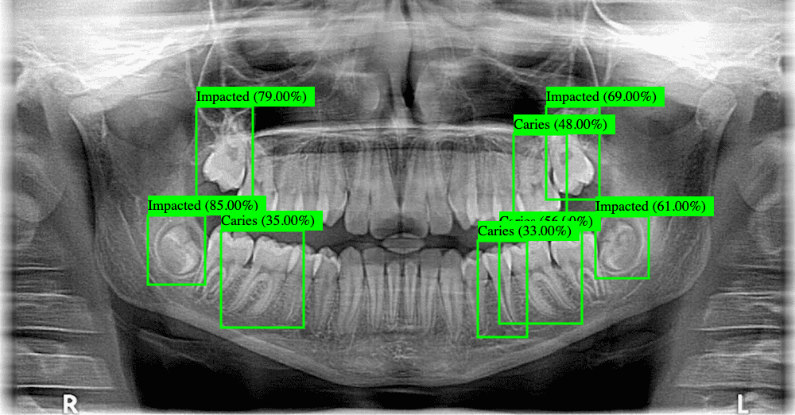

# TeethXrayAI
A computer vision project for AI teeth xray analysis. This repo features a yolov8 object detection model based on the [dentex dataset](https://universe.roboflow.com/dentex/dentex-3xe7e) and a simple web interface for querying it. 
If you dont want to selfhost it then you can use my personal deployment https://xray.cyphersec.eu/



## Content
1. Self hosting
2. Training
3. Evaluation

## Self Hosting
If you dont want to use the demo deployment and deploy the webUI yourself you have 2 options. You can either download the pretrained yolov8 model that i trained or you can train it yourself.
Download link: [dental model](https://xray.cyphersec.eu/download)
 After downloading it/training it just pop it into the root of this repo and name it "best.pt". After that run 
```
python3 -m pip install -r requirements.txt
```
followed by
```
python3 object_detector.py
```
This should make the UI available on http://127.0.0.1:8080
## Training Proccess
For training i used the YOLO package from the python ultralytics libary. Luckily this makes the training fairly easy.
Step 1: Head over to roboflow and create an account. Once youre logged in go to https://universe.roboflow.com/dentex/dentex-3xe7e/dataset/2 and choose download dataset. Instead of downloading it directly i would recommend to get the download code in python and running that as the dataset has to be in ~/datasets/dentex-2/ in order for our training tool to find it. After the dir is in that location run 

```
pip3 install ultralytics roboflow && yolo train data=data.yaml model=yolov8n.pt epochs=50 imgsz=640 cache=True
```
The model will be saved in ~/datasets/dentex-2/runs/detect/train/weights/best.pt.
